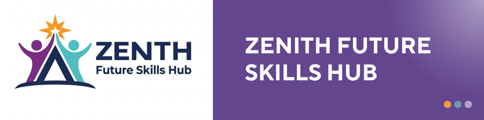

<p align="center">
  
</p>

<h1 align="center">Zenith NPO Platform</h1>

<p align="center">
  A full-stack platform for managing applications, learners and programme progress for Zenith Future Skills Hub.
</p>


## Overview

Zenith NPO Platform is a web application designed for **Zenith Future Skills Hub**, a South African nonprofit organisation focused on technology skills and career development.

The platform brings key processes into one system:

* Public programme information
* Learner applications
* Application review and approval
* Learner management
* Progress and results tracking
* Administration

## Technology

* **Frontend:** HTML, CSS, JavaScript, React
* **Backend:** C# / .NET
* **Database:** SQLite
* **Tools:** VS Code, Git, GitHub, Swagger

## Architecture

```text
Frontend
   ↓
REST API
   ↓
Business Logic
   ↓
Database
```

## Project Status

**Current Phase:** Implementation

* [x] Requirements
* [x] Architecture
* [x] ERD / Database Design
* [x] Domains & Models
* [x] Screen Design
* [ ] Backend
* [ ] Frontend
* [ ] Integration
* [ ] Testing
* [ ] Deployment

## Documentation

Project documentation covers the requirements, architecture, database design, domains/models, screens and implementation decisions.

## Author

**Katlego Mathebula**

Built as a portfolio project for **Zenith Future Skills Hub**.

