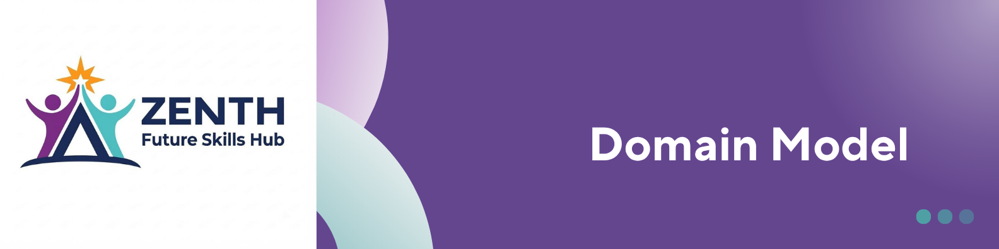

<p align="center">
  
</p>

# Zenith Platform : Domain Model

**Version:** 1.0 | **Status:** V1 Baseline

## Purpose

The domain model defines the core business entities supporting:

```text
Apply → Review → Approve → Manage Learner → Track Progress / Results
```

## Core Entities

| Entity      | Purpose                                          |
| ----------- | ------------------------------------------------ |
| Applicant   | Person who applies to Zenith.                    |
| Application | Application submitted by an applicant.           |
| User        | Authorised internal staff/admin user.            |
| Learner     | Approved applicant participating in a programme. |
| Programme   | Zenith training programme.                       |
| Cohort      | Specific programme intake/group.                 |
| Module      | Learning module within a programme.              |
| Progress    | Learner progress within a module.                |
| Result      | Learner's recorded result for a module.          |

## Relationships

* Applicant can submit applications.
* Application belongs to an applicant and programme.
* Approved application can create a learner.
* Learner belongs to a programme and cohort.
* Programme contains modules.
* Learner has progress and results against modules.
* User manages protected platform functions.

## Business Rules

1. Every application belongs to an applicant.
2. Every application relates to a programme.
3. Only approved applications create learners.
4. Learners are associated with programmes and cohorts.
5. Programmes contain modules.
6. Progress and results belong to a learner and module.
7. Protected information requires authorised access.
8. V1 does not assume a learner self-service portal.

## Design Principle

The model contains only the entities required for V1 and avoids unnecessary complexity.
