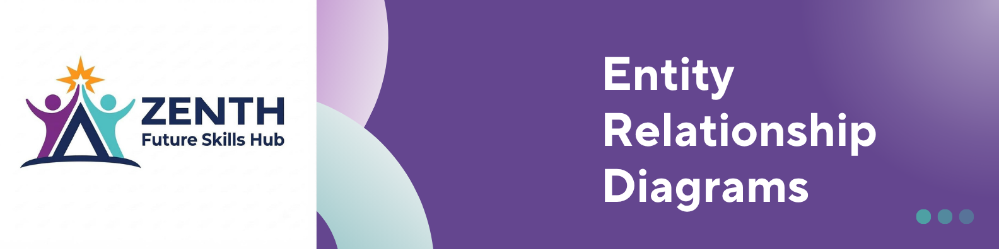
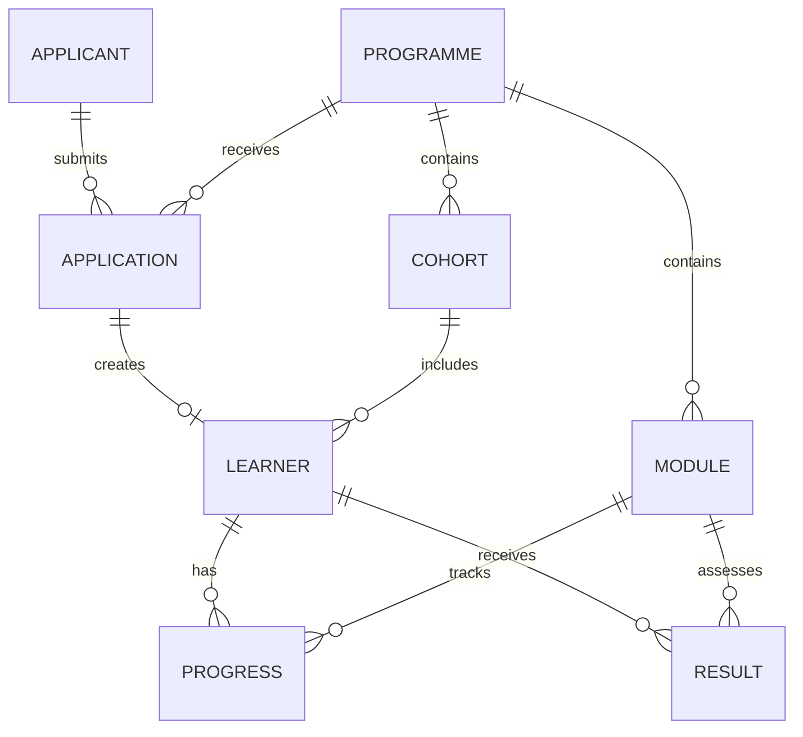

    

# Zenith Platform : Entity Relationship Diagram

**Version:** 1.0 | **Status:** V1 Baseline

## Purpose

The ERD translates the approved domain model into the relational database structure required for V1.

## Core Relationships

## Entities

* **Applicant** — applicant information.
* **Application** — submitted programme application.
* **User** — authorised staff/admin account.
* **Learner** — approved applicant.
* **Programme** — training programme.
* **Cohort** — programme intake.
* **Module** — programme learning unit.
* **Progress** — learner progress.
* **Result** — learner result.

## Key Rules

* An applicant can have multiple applications.
* An application belongs to one applicant and one programme.
* An approved application can create one learner.
* A learner belongs to a programme and cohort.
* A programme contains modules.
* Progress and results connect learners to modules.
* Protected information requires authorised access.
