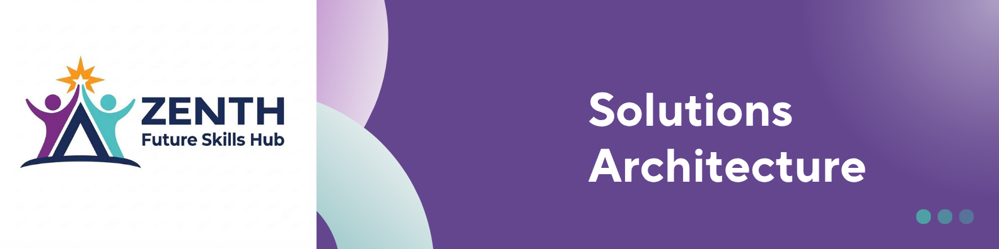

<p align="center">
  
</p>

# Zenith Platform : Solution Architecture

**Version:** 1.0 | **Status:** V1 Baseline

## Architecture

Zenith Platform uses a simple layered web architecture:

```text
Users
  ↓
Frontend
  ↓
Backend API
  ↓
Database
```

Authentication protects internal staff functions.

## Components

| Component      | Responsibility                                   |
| -------------- | ------------------------------------------------ |
| Frontend       | Public website, application and staff interface. |
| Backend API    | Business logic, validation and data access.      |
| Authentication | Protects internal functionality.                 |
| Database       | Stores application and learner information.      |
| Cloud          | Hosts the application and supporting services.   |

## Data Flow

### Applicant

```text
Applicant → Frontend → API → Database
```

### Staff

```text
Staff → Authentication → Protected Frontend → API → Database
```

## Principles

* Keep V1 simple.
* Separate frontend, backend and database responsibilities.
* Protect personal information.
* Avoid unnecessary technologies.
* Keep the solution maintainable and testable.
* Consider cost in technical decisions.
* Allow reasonable future growth.
* Use managed cloud services where practical.

## Architecture Decision

V1 will use a **single application architecture**, not microservices, because the platform is small and does not require enterprise-level complexity.
